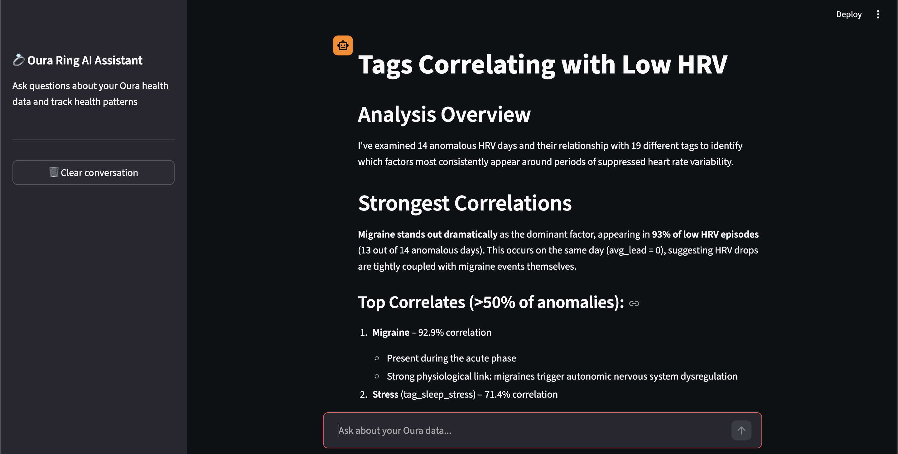
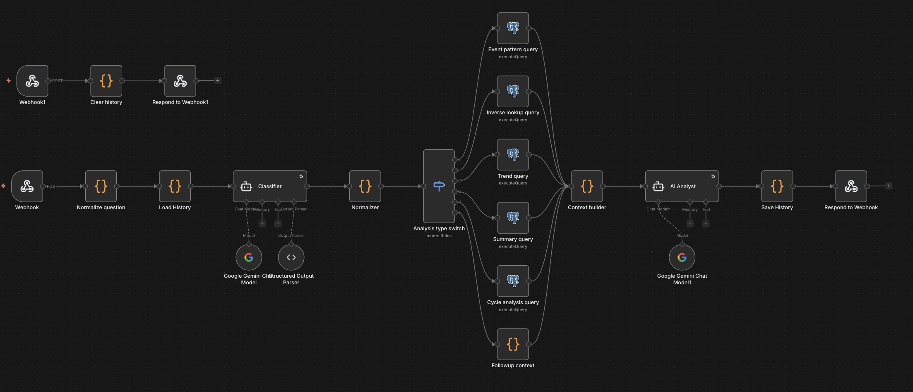

# Oura Ring Personal Health Analytics

> **v1.1** — Data ingestion migrated from n8n to pure Python. AI chat workflow still runs via n8n.

An end-to-end personal health analytics platform that ingests Oura Ring biometric data into a PostgreSQL database and exposes it through an AI-powered conversational interface. The data pipeline is a pure Python ETL script with automated scheduling, while the AI analysis layer uses n8n for query routing, PostgreSQL for analytical queries, and Streamlit as the chat interface.

Its core capability is **pattern discovery based on custom user-defined tags** (e.g., symptoms, lifestyle factors), with built-in temporal analysis of physiological changes before, during, and after tagged events. This allows users to uncover relationships between various personal events and signals such as HRV, sleep, and recovery — a level of insight not available in the native Oura app. Summary and trend conversational analyses are possible as well.

Ask questions in natural language and receive structured, evidence-based insights into your sleep, recovery, activity, stress, menstrual cycle, and personalized health recommendations.

---

## What it does

**Example queries the system can answer:**

* *"What happens to my resting heart rate during and after having a cold?"*
* *"What tags correlate with low HRV?"*
* *"Do I show early physiological signals before tagged stress events?"*
* *"Show me my readiness trend over the last 30 days"*
* *"What is my migraine risk today based on my previous data?"*
* *"Give me a health overview of the past week"*

The AI response always includes today's actual metrics — HRV in milliseconds, resting heart rate in bpm, cycle day and phase, stress minutes — pulled from the correct sensor columns rather than Oura's readiness contributor scores.

---

## Architecture

```
Oura Ring API v2
       │
       ▼
  Python ETL (oura_etl.py)
       │
       ├── Scheduled via macOS launchd (daily at 11:00)
       ├── Fetches 8 endpoints with 3-day rolling lookback
       ├── Batch upserts into PostgreSQL (ON CONFLICT)
       └── Refreshes derived oura_cycles table
       │
       ▼
  PostgreSQL (local)
       │
       ▼
  n8n AI chat workflow
       ├── AI classifier       → structured routing params
       ├── Normalizer (JS)     → validation & edge-case handling
       ├── Switch node         → 5 analysis branches
       │     ├── event_pattern    (tag-based, with day offsets)
       │     ├── inverse_lookup   (what correlates with low X?)
       │     ├── trend            (rolling 7/30/90-day averages)
       │     ├── summary          (period snapshot)
       │     └── cycle_analysis   (menstrual cycle biomarkers)
       ├── PostgreSQL queries  → pre-aggregated results
       ├── Context Builder     → structured JSON for AI
       └── AI Agent            → natural language analysis
       │
       ▼
  Streamlit (chat.py)
       └── HTTP → n8n webhook → AI workflow → response
```

---

## Data Pipeline (v1.1 — Python)

The ETL script (`oura_etl.py`) replaces the previous n8n-based ingestion workflows with a single Python script. Key improvements over the n8n version:

- **Batch inserts** — heart rate data (thousands of rows/day) is inserted in chunks of 5,000 via `execute_values`, replacing n8n's row-by-row approach
- **Atomic transactions** — single `commit()` on success, full `rollback()` on any failure
- **CLI flexibility** — `--days N` for custom lookback/backfill, `--daemon` for persistent scheduling
- **Portable** — no Docker or n8n dependency for data ingestion; runs anywhere with Python 3.9+ and PostgreSQL
- **Fully version-controlled** — all logic in a single auditable Python file

### Endpoints ingested

| Endpoint | Table | Conflict key | Content |
| --- | --- | --- | --- |
| `/sleep` | `oura_sleep` | `id` | Detailed sleep with HRV/HR 5-min timeseries |
| `/daily_sleep` | `oura_daily_sleep` | `day` | Sleep score and contributors |
| `/daily_readiness` | `oura_daily_readiness` | `day` | Readiness score, temperature deviation |
| `/daily_activity` | `oura_daily_activity` | `day` | Steps, calories, activity breakdown |
| `/daily_stress` | `oura_daily_stress` | `day` | Stress and recovery minutes |
| `/heartrate` | `oura_heartrate` | `timestamp` | Continuous heart rate (DO NOTHING on conflict) |
| `/workout` | `oura_workouts` | `id` | Workout sessions with intensity |
| `/enhanced_tag` | `oura_events` | `id` | Symptoms, lifestyle tags |
| *(derived)* | `oura_cycles` | `day` | Cycle day, phase, temperature phase, symptom flags |

---

## Key Technical Decisions

**Aggregation over iteration** — all SQL queries return pre-aggregated results via `UNION ALL` with a `result_type` discriminator column. This reduces output from tens of thousands of rows to ~30–50 rows per query, making LLM analysis reliable and cost-efficient.

**Correct sensor columns** — Oura API v2 exposes both raw sensor values (`average_hrv` in ms, `lowest_heart_rate` in bpm from `oura_sleep`) and readiness contributor scores (`hrv_balance`, `resting_heart_rate` as 1–100 from `oura_daily_readiness`). The pipeline explicitly separates these to prevent the AI from misreporting scores as physiological values.

**Cycle-aware analysis** — a custom `oura_cycles` table is derived from period tags, computing `cycle_day`, `cycle_phase`, and `temperature_phase` per calendar day using a LATERAL join approach. Every analysis branch joins this table so all health insights include hormonal context.

**Workout integration** — `oura_workouts` data is joined into all analysis branches, enabling the AI to detect patterns such as exercise as a migraine trigger or its effect on next-day HRV recovery.

**Conversation memory** — the AI chat workflow maintains a rolling 10-turn conversation history via n8n static data, enabling follow-up questions without repeating context.

---

## Stack

| Layer | Technology |
| --- | --- |
| Data source | Oura Ring API v2 |
| Data pipeline | Python (requests, psycopg2) |
| Scheduling | macOS launchd |
| Database | PostgreSQL |
| AI orchestration | n8n (self-hosted, Docker) |
| Classification LLM | Google Gemini (structured JSON output) |
| Analysis LLM | Google Gemini |
| Chat interface | Streamlit |

---

## Repository Structure

```
oura-health-analytics/
├── README.md
├── requirements.txt
├── .env.example                                 # Credentials template
├── .gitignore
│
├── oura_etl.py                                  # Python ETL pipeline (v1.1)
├── com.oura.daily-etl.plist                   # macOS launchd schedule config
│
├── chat.py                                      # Streamlit chat interface
│
└── workflows/
    ├── Oura-historical-backfill-public.json     # Legacy: n8n backfill (replaced by oura_etl.py --days N)
    ├── Oura-daily-update-public.json            # Legacy: n8n daily update (replaced by oura_etl.py)
    └── Oura-AI-chat-public.json                 # Active: AI chat backend
```

---

## Setup

### Prerequisites

* Oura Ring with API v2 personal access token ([get one here](https://cloud.ouraring.com/personal-access-tokens))
* PostgreSQL instance (local or remote)
* Python 3.9+
* n8n self-hosted ([Docker quickstart](https://docs.n8n.io/hosting/installation/docker/)) — for AI chat only
* Google Gemini API key (can be swapped for Claude or other LLM)

### 1. Database

Create the required tables. Schema file coming in next release — in the meantime the table structures can be inferred from the upsert statements in `oura_etl.py`.

### 2. Configure the ETL pipeline

```bash
# Clone the repo
git clone https://github.com/agkaras/oura-health-analytics.git
cd oura-health-analytics

# Create virtual environment
python3 -m venv .venv
source .venv/bin/activate

# Install dependencies
pip install -r requirements.txt

# Configure credentials
cp .env.example .env
# Edit .env with your Oura token and Postgres credentials
```

### 3. Run initial data load

```bash
# Backfill all historical data (adjust days to match when you got your ring)
python oura_etl.py --days 365

# Or just test with last 3 days
python oura_etl.py
```

### 4. Set up daily scheduling (macOS)

```bash
# Edit the plist — replace YOUR_USERNAME with your macOS username
sed -i '' 's/YOUR_USERNAME/your_username/g' com.oura.daily-etl.plist

# Create log directory
mkdir -p logs

# Install and load the schedule
cp com.oura.daily-etl.plist ~/Library/LaunchAgents/
launchctl load ~/Library/LaunchAgents/com.oura.daily-etl.plist

# Verify
launchctl list | grep oura
```

The pipeline will run daily at 11:00, fetching the last 3 days to catch any retroactive Oura corrections.

**Alternative scheduling:** use `python oura_etl.py --daemon` for a persistent Python process (requires `apscheduler`), or adapt to `cron`/`systemd` on Linux.

### 5. Set up the AI chat (optional)

* Import `workflows/Oura-AI-chat-public.json` into n8n
* Update credentials (PostgreSQL, Gemini)
* Start Streamlit:

```bash
streamlit run chat.py
```

---

## Usage

```bash
# Standard daily run (last 3 days, same as scheduled)
python oura_etl.py

# Custom lookback
python oura_etl.py --days 30

# Full historical backfill
python oura_etl.py --days 730

# Persistent daemon mode (daily at 11:00 Europe/Warsaw)
python oura_etl.py --daemon
```

Logs are written to `logs/oura_etl.log`.

---
## Preview






## Project Status & Roadmap

- [x] ~~Python rebuild: replace n8n orchestration with pure Python ingestion~~ *(v1.1)*
- [ ] Add `schema.sql` for full database reproducibility
- [ ] Migrate AI chat from n8n to Python (FastAPI + LangChain or direct API)
- [ ] Streamlit dashboard with visualisations alongside the chat interface
- [ ] Unit tests for SQL query logic
- [ ] docker-compose setup bundling PostgreSQL + chat interface

---

## Privacy Note

All data stays local — local PostgreSQL and local Python scripts. The only external calls are to the Oura API (to fetch your data) and the LLM APIs (query context only, no raw biometric timeseries are sent).

---

## Author

Built by a biomedical scientist exploring applied data science through personal health analytics.

*Feedback and questions welcome via GitHub Issues.*
